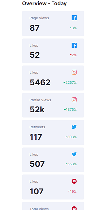

# Frontend Mentor - Social media dashboard with theme switcher solution

This is a solution to the [Social media dashboard with theme switcher challenge on Frontend Mentor](https://www.frontendmentor.io/challenges/social-media-dashboard-with-theme-switcher-6oY8ozp_H). Frontend Mentor challenges help you improve your coding skills by building realistic projects.

## Table of contents

- [Overview](#overview)
  - [The challenge](#the-challenge)
  - [Screenshot](#screenshot)
  - [Links](#links)
- [My process](#my-process)
  - [Built with](#built-with)
  - [What I learned](#what-i-learned)
- [Author](#author)

## Overview

### The challenge

Users should be able to:

- View the optimal layout for the site depending on their device's screen size
- See hover states for all interactive elements on the page
- Toggle color theme to their preference

### Screenshot

### Links

- Solution URL: [git repo](https://github.com/MikeJD47/Social-Media-Dashboard)
- Live Site URL: [Social media Dashboard](https://your-live-site-url.com)

## My process

### Built with

- Semantic HTML5 markup
- CSS custom properties
- Flexbox
- CSS Grid
- Mobile-first workflow
- Vanilla Javascript

### What I learned

Really didn't enjoy this one, took very long to complete. I am happy how I was able to get the linear gradient looking border for the instagram overview block. And I'm relieved that i managed to get the Light and Dark mode to work as intended. The site is unfortunately not very responsive. Looks good in full sized desktop and mobile exclusively, nothing in between.

### Useful resources

- [The entire MND](https://developer.mozilla.org/en-US/) - Thank goodness this exists!

## Author

- Frontend Mentor - [@MikeJD47](https://www.frontendmentor.io/profile/MikeJD47)
